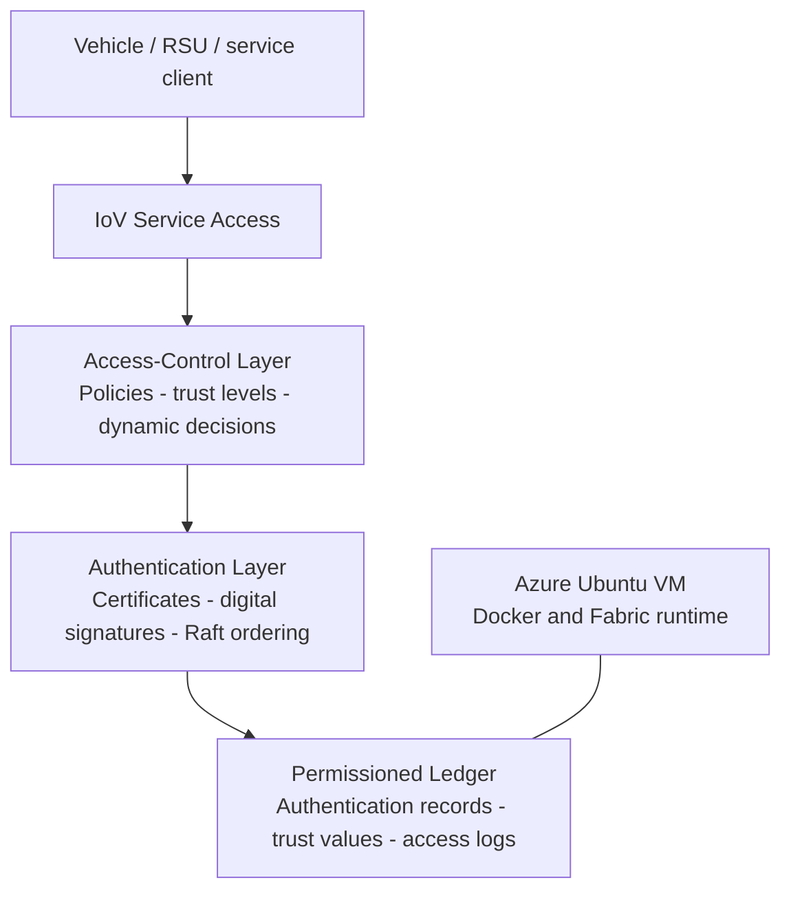

# Trust-Aware IoV Access Control Prototype

**Permissioned-ledger authentication and behaviour-sensitive authorisation for Internet-of-Vehicles systems**

This repository is a curated public evidence archive for a 2025–2026 Internet of Things coursework project. It documents an end-to-end prototype that combined distributed authentication, trust-aware access control, smart-contract policy enforcement, and cloud-hosted deployment.

> Public scope: this is not a complete release of the original coursework submission, raw screenshots, interactive Packet Tracer files, or all implementation assets. Claims are limited to evidence that can be described accurately without redistributing restricted material.

## Core problem

Internet-of-Vehicles systems exchange sensitive vehicle, road, and service data across vehicles, roadside units, edge services, and traffic-management organisations. Static or centralised authorisation can create single points of failure and cannot easily adapt permissions when node behaviour changes.

The project addressed three design problems:

1. centralised authentication and single-point-of-failure risk;
2. insufficiently fine-grained and static authorisation;
3. the absence of behaviour-sensitive trust evaluation.

## Prototype design

The prototype combined:

- Hyperledger Fabric consortium-chain authentication;
- digital-certificate verification and auditable on-chain records;
- attribute-based permission decisions;
- trust-score updates mapped to access levels;
- smart-contract-enforced grant, denial, or revocation decisions;
- Azure Ubuntu VM deployment evidence;
- workload evaluation covering throughput, latency, CPU use, and simulated malicious-node scenarios.

## Architecture

## Prototype flow

1. A vehicle or service identity is registered and associated with a digital certificate.
2. A request is checked against identity, attributes, current trust level, and policy conditions.
3. Chaincode returns an allow, deny, or revoke decision.
4. Authentication and access events are recorded for auditability.
5. Behaviour outcomes update the node trust value, which can change later permissions.

## Public evidence

- [Original coursework report — public summary](docs/course-report-summary.md)
- [Supporting networking foundation](docs/networking-foundation.md)
- [Evidence and privacy policy](docs/evidence-policy.md)
- [Related Fabric/Kubernetes infrastructure repository](https://github.com/haveanicedaymydear/FabricK8s)

## Important distinction

The access-control prototype and the later `FabricK8s` infrastructure evidence are related but not identical:

- this repository documents the IoV problem formulation, trust-aware policy logic, certificate-based identity, and prototype workflow;
- `FabricK8s` documents later infrastructure and deployment work.

## Claim boundary

The original report contains quantitative performance figures and simulated attack scenarios. They are not presented here as independently revalidated research findings because the complete code, raw logs, and all original environment assets are not publicly reproducible.

The strongest supported contribution is the system design and exercised prototype workflow:

- distributed certificate-based authentication;
- immutable access and trust records;
- dynamic trust updates;
- smart-contract policy enforcement;
- Azure-hosted deployment;
- performance and security-scenario evaluation workflow.

## Limitations

- Coursework-scale prototype rather than a production vehicle-security system.
- Complete chaincode and environment configuration are not released here.
- Original `.pka` files remain private because they can contain course-authored assessment material.
- Public documentation does not claim reproduction of every numerical result in the private report.

## Status

Original project period: **December 2025 – January 2026**  
Public evidence archive consolidated: **July 2026**

## Author

Livan Zhou — [zhoulivan@gmail.com](mailto:zhoulivan@gmail.com)

## License

The original project may include third-party or course-provided material that is not redistributed. The public documentation authored for this repository is released under the MIT License; see [LICENSE](LICENSE).
